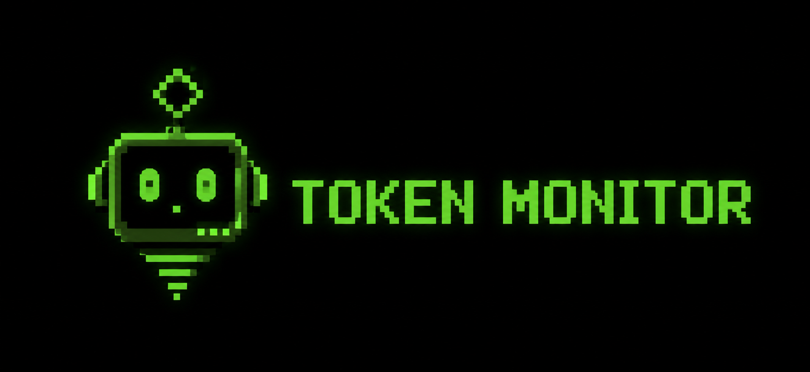

<div align="center">
  

  # Token Monitor

  **Monitor en tiempo real del consumo de tokens de Claude Code y Codex CLI**

  
  
  
  
</div>

---

## ¿Qué es esto?

Una pantalla flotante de escritorio que lee en tiempo real los logs de **Claude Code** y **Codex CLI** y muestra:

- Tokens consumidos por sesión (ventana de 5h) y acumulados por semana, mes y año
- Modelo detectado automáticamente (`claude-sonnet-4-6`, `gpt-5.4`, etc.)
- Costo estimado en dólares usando precios reales de API por modelo
- Barra de uso calibrable contra `claude.ai/settings` con factor de corrección
- System tray de Windows con tooltip de uso en tiempo real
- Scroll vertical para agregar más proveedores sin romper el layout

---

## Instalación

```bash
git clone https://github.com/CodHector/token-monitor
cd token-monitor
pip install -r requirements.txt
python -m token_monitor
```

---

## Uso

```bash
# Modo demo — datos simulados sin herramientas instaladas
python -m token_monitor --demo

# Claude Code solamente
python -m token_monitor --claude-dir ~/.claude/projects/

# Codex CLI solamente
python -m token_monitor --codex-dir ~/.codex/sessions/

# Los dos juntos (modo por defecto)
python -m token_monitor

# Presupuesto diario personalizado en USD
python -m token_monitor --budget 20

# Forzar re-detección de herramientas instaladas
python -m token_monitor --redetect
```

---

## ¿Cómo funciona?

### Claude Code

Claude Code escribe cada request en archivos `.jsonl` dentro de `~/.claude/projects/`. El monitor los lee cada 5 segundos **sin tocar ninguna API** — solo lectura de logs locales.

Cada línea tiene el campo `message.model` (modelo usado) y `message.usage` (tokens de input, output y cache). El monitor acumula los **output tokens** como métrica principal porque son los únicos que no se repiten entre requests a diferencia del contexto de input acumulado.

La barra de sesión se calibra contra `claude.ai/settings` con un **factor de corrección** ajustable desde ⚙ sin reiniciar el monitor.

### Codex CLI

Codex escribe sus sesiones en `~/.codex/sessions/**/rollout-*.jsonl`. El monitor detecta el modelo en los eventos `turn_context` (campo `payload.model`) y acumula tokens desde los eventos `token_count` usando `last_token_usage` — no `total_token_usage` — para evitar doble conteo al sumar línea a línea.

---

## Estructura del proyecto

```text
token_monitor/
├── __main__.py        Bootstrap — detección, scanners, UI, tray
├── config.py          Constantes, precios por modelo, colores, tamaños
├── detector.py        Detección de Claude Code y Codex CLI instalados
├── parser.py          Parseo de JSONL y cálculo de costo por modelo
├── state.py           Estado compartido thread-safe entre scanners y UI
├── scanner.py         Scanner de JSONL de Claude Code
├── codex_scanner.py   Scanner de JSONL de Codex CLI
├── codex_status.py    Poller de `codex /status` para rate-limits en vivo
├── wrapper.py         Generación de scripts wrapper para Codex en tiempo real
├── ui.py              Interfaz Tkinter flotante con scroll
├── tray.py            Integración system tray
├── settings_ui.py     Ventana de configuración y calibración
├── demo.py            Inyector de datos demo
└── assets/            Íconos de la aplicación
assets/
└── banner.png         Banner del proyecto
```

---

## Modelos soportados

### Claude (Anthropic) — precios USD por millón de tokens

| Modelo | Input | Cache Write | Cache Read | Output |
|--------|------:|------------:|-----------:|-------:|
| claude-opus-4-7 / 4-6 | $5.00 | $6.25 | $0.50 | $25.00 |
| claude-sonnet-4-6 | $3.00 | $3.75 | $0.30 | $15.00 |
| claude-haiku-4-5 | $1.00 | $1.25 | $0.10 | $5.00 |
| claude-opus-4-1 | $15.00 | $18.75 | $1.50 | $75.00 |
| claude-sonnet-3-7 | $3.00 | $3.75 | $0.30 | $15.00 |
| claude-haiku-3-5 | $0.80 | $1.00 | $0.08 | $4.00 |

### Codex / OpenAI — precios USD por millón de tokens

| Modelo | Input | Cached | Output |
|--------|------:|-------:|-------:|
| gpt-5.5 | $5.00 | $0.50 | $30.00 |
| gpt-5.4 | $3.00 | $0.30 | $15.00 |
| gpt-5.4-mini | $0.50 | $0.05 | $2.00 |
| gpt-5.3-codex / spark | $1.75 | $0.175 | $14.00 |
| gpt-5.2-codex | $1.50 | $0.15 | $12.00 |
| gpt-5.1-codex-mini | $0.25 | $0.025 | $2.00 |
| gpt-4o | $2.50 | $1.25 | $10.00 |
| gpt-4o-mini | $0.15 | $0.075 | $0.60 |
| gpt-4.1 | $2.00 | $0.50 | $8.00 |
| gpt-4.1-mini | $0.40 | $0.10 | $1.60 |
| o3 | $10.00 | $2.50 | $40.00 |
| o4-mini | $1.10 | $0.275 | $4.40 |

> Los precios viven en `token_monitor/config.py` como diccionarios. Actualizar un precio = una línea de código.

---

## Calibración

Si el porcentaje no coincide con `claude.ai/settings`:

1. Abre ⚙ en el monitor
2. Sección **"Calibrar límites"**: ingresa el % actual de la web → recalcula los límites en tokens desde cero
3. Sección **"Recalibrar factor"**: si ya tienes límites calibrados, ajusta el multiplicador fino sin cambiarlos

---

## Roadmap

- [ ] Gemini CLI
- [ ] GitHub Copilot
- [ ] Cursor
- [ ] Notificaciones de alerta al cruzar umbrales configurables
- [ ] Exportar historial a CSV
- [ ] Tests automatizados de parsers

---

## Contribuir

1. Fork del repo
2. `git checkout -b feature/nueva-ia`
3. Para agregar un proveedor nuevo, implementa un scanner siguiendo el patrón de `scanner.py` o `codex_scanner.py`
4. Los precios del modelo nuevo van en `config.py` como dict `{modelo: {in, cached, out}}`
5. PR con descripción de qué IA agregaste y cómo detectaste el modelo en sus logs locales

---

## Licencia

MIT — hecho con ❤️ para la comunidad dev hispana
