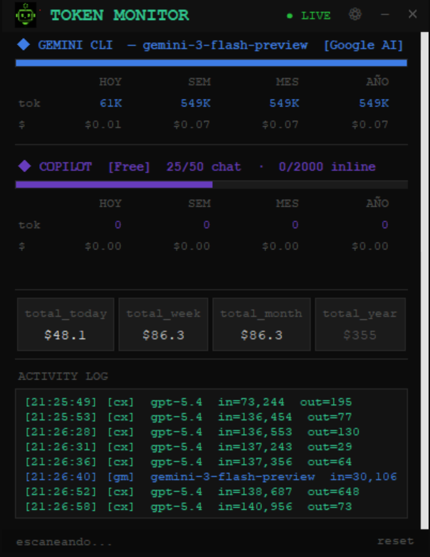
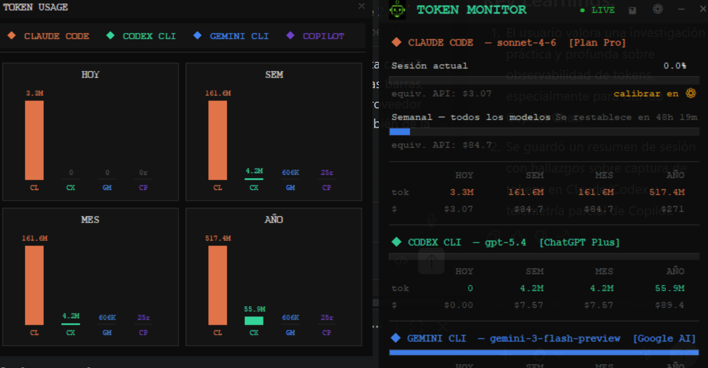

<div align="center">
  

  # Token Monitor

  **Monitor en tiempo real del consumo de tokens de Claude Code, Codex CLI, Gemini CLI y GitHub Copilot**

  
  
  
  
</div>

---

## ¿Por qué Token Monitor?

Los dashboards de Anthropic, OpenAI y Google te dicen cuánto gastaste **ayer**.  
Este monitor te lo dice **ahora**, mientras escribís.

✓ **Claude + Codex + Gemini + Copilot en un solo lugar** — sin cambiar de pestaña  
✓ **Costos en tiempo real** — dólares acumulados por sesión, día, semana y mes  
✓ **Históricos locales** — CSV diario en `~/.token-monitor/logs/`, sin dependencias externas  
✓ **Compará modelos** — sabé si el Sonnet justifica el precio sobre Haiku en tu flujo real  
✓ **Cero APIs** — lee solo logs locales; no envía datos a ningún servidor

> Si Anthropic, OpenAI o GitHub agregan dashboards parecidos, verás tokens.  
> Este monitor ya tiene comparativas, tendencias e históricos — eso no lo replican fácil.

---

## Lo que ves en 3 segundos



### Gráficas de barras — botón `📊`



---

## ¿Qué incluye?

- **Barras de uso calibrables** — sesión y semanal contra `claude.ai/settings` con factor de corrección
- **Modelo detectado automáticamente** — `claude-sonnet-4-6`, `gpt-5.4`, `gemini-2.5-pro`, `gpt-4o` sin configurar nada
- **GitHub Copilot Free**: dos cuotas separadas — `24/50 chat` y `0/2000 inline completions`
- **Gráficas de barras en tiempo real** — botón `📊` en el header abre 4 mini-gráficas (hoy / semana / mes / año) coloreadas por proveedor, con leyenda y auto-refresco cada 2s
- **System tray de Windows** — tooltip de uso en tiempo real, arranca minimizado por defecto
- **Logs diarios en CSV** — `~/.token-monitor/logs/YYYY-MM-DD.txt`, actualizados cada 60s
- **Scroll vertical** — agregá más proveedores sin romper el layout
- **Interfaz en español e inglés** — cambiable en ⚙ sin reiniciar

---

## Descarga directa

👉 **[token-monitor-windows.exe](https://github.com/Giojacke/token-monitor/releases/latest)**

No necesitas Python — solo descarga y ejecuta.

> El `.exe` se compila automáticamente con GitHub Actions cada vez que se publica una nueva versión (`git tag v1.x.x`).

---

## Instalación desde código

```bash
git clone https://github.com/Giojacke/token-monitor
cd token-monitor
pip install -r requirements.txt
python -m token_monitor
```

---

## Uso

```bash
# Modo demo — datos simulados sin herramientas instaladas
python -m token_monitor --demo

# Claude Code solamente
python -m token_monitor --claude-dir ~/.claude/projects/

# Codex CLI solamente
python -m token_monitor --codex-dir ~/.codex/sessions/

# Los dos juntos (modo por defecto)
python -m token_monitor

# Presupuesto diario personalizado en USD
python -m token_monitor --budget 20

# Forzar re-detección de herramientas instaladas
python -m token_monitor --redetect
```

> Al arrancar, el monitor se minimiza automáticamente al system tray. El ícono queda visible con un tooltip de uso en tiempo real.

---

## ¿Cómo funciona?

### Claude Code

Claude Code escribe cada request en archivos `.jsonl` dentro de `~/.claude/projects/`. El monitor los lee cada 5 segundos **sin tocar ninguna API** — solo lectura de logs locales.

Cada línea tiene el campo `message.model` (modelo usado) y `message.usage` (tokens de input, output y cache). El monitor acumula los **output tokens** como métrica principal porque son los únicos que no se repiten entre requests a diferencia del contexto de input acumulado.

La barra de sesión se calibra contra `claude.ai/settings` con un **factor de corrección** ajustable desde ⚙ sin reiniciar el monitor.

### Codex CLI

Codex escribe sus sesiones en `~/.codex/sessions/**/rollout-*.jsonl`. El monitor detecta el modelo en los eventos `turn_context` (campo `payload.model`) y acumula tokens desde los eventos `token_count` usando `last_token_usage` — no `total_token_usage` — para evitar doble conteo al sumar línea a línea.

### Gemini CLI

Gemini CLI escribe sus chats en `~/.gemini/tmp/<usuario>/chats/session-*.jsonl`. El monitor detecta dinámicamente el subdirectorio del usuario (con fallback automático para entornos corporativos o Docker).

El JSONL de Gemini usa un patrón de append-update donde la misma entrada puede aparecer múltiples veces. El monitor deduplica por `id` para evitar doble conteo.

### GitHub Copilot

La extensión de VS Code escribe logs en:

- **Windows:** `%APPDATA%\Code\logs\<session>\window1\exthost\GitHub.copilot-chat\`
- **Mac:** `~/Library/Application Support/Code/logs/.../GitHub.copilot-chat/`
- **Linux:** `~/.config/Code/logs/.../GitHub.copilot-chat/`

El monitor parsea **dos formatos distintos** del mismo archivo `.log`:

- `[fetchCompletions] ... finished with 200` → inline completions (cuota: 2000/mes en Free)
- `ccreq:ID | success | model | Xms | [source]` → chat, Copilot Edits, agente (cuota: 50/mes en Free)

Los costos mostrados son el **equivalente en API** — el costo real para el usuario es la suscripción mensual de Copilot.

#### Por qué tok = 0 en Copilot

A diferencia de Claude Code, Codex y Gemini — que escriben los conteos de tokens en sus logs locales — **la extensión de VS Code de GitHub Copilot no registra tokens de input/output en ningún archivo local**. Los dos formatos de log solo indican que ocurrió una request y si tuvo éxito; no hay campo `usage`, `token_count` ni equivalente.

Se investigaron todas las alternativas conocidas:

| Alternativa | Resultado |
|---|---|
| Logs de VS Code (`exthost/GitHub.copilot-chat/`) | Solo registra eventos de request, sin conteo de tokens |
| `%APPDATA%\GitHub Copilot\` y `globalStorage\` | Configuración y caché de sesión, sin métricas de uso |
| API REST de GitHub (`/orgs/{org}/copilot/usage`) | Requiere rol de administrador de organización + PAT; no existe endpoint para usuarios individuales |
| Copilot CLI | Producto distinto a la extensión de VS Code; sus datos no reflejan el uso desde el editor |
| Dashboard web de GitHub | Visible solo para admins de org desde junio 2026; no accesible para cuentas Free/Pro individuales |

**Lo que sí se captura:** el conteo de requests por tipo (`chat_req` y `comp_req`) y el modelo usado — suficiente para saber cuánto te queda de la cuota mensual (`25/50 chat`, `0/2000 inline`). Los tokens estimados quedan en 0 porque no hay fuente de datos local que los exponga.

---

## Logs diarios

El monitor genera automáticamente dos archivos por día en `~/.token-monitor/logs/`:

### `YYYY-MM-DD.csv` — resumen por modelo

Una fila por cada combinación proveedor+modelo detectada en el día. Se sobreescribe cada 60 segundos con los totales actualizados.

```
provider,model,date,tokens_in,tokens_out,requests,cost_usd
claude,sonnet-4-6,2026-06-02,284231,3667,15,0.055005
codex,gpt-5.4,2026-06-02,140956,1073,9,0.018214
copilot,gpt-4o,2026-06-02,0,0,25,0.000000
gemini,gemini-3-flash-preview,2026-06-02,549000,502,9,0.000433
```

Si usás dos modelos distintos del mismo proveedor en el mismo día (ej. `sonnet-4-6` por la mañana y `haiku-4-5` por la tarde) aparecen como filas separadas. El costo de Copilot queda en `0.000000` porque sus logs locales no exponen conteo de tokens (ver sección anterior).

### `YYYY-MM-DD-activity.txt` — auditoría en tiempo real

Cada request capturado, en el mismo formato que muestra el Activity Log de la UI. Se actualiza cada 10 segundos en **modo append** — nunca se sobreescribe, crece durante el día y queda como registro permanente.

```
[21:25:49] [cx]  gpt-5.4  in=73,244  out=195
[21:26:28] [cl]  sonnet-4-6  in=136,553  out=130
[21:26:40] [gm]  gemini-3-flash-preview  in=30,106  out=502
[21:26:58] [ch]  gpt-4o  req+1
[21:26:59] [cp]  gpt-4o  req+1
```

Tags de proveedor: `[cl]` Claude · `[cx]` Codex · `[gm]` Gemini · `[ch]` Copilot chat · `[cp]` Copilot inline completion

Ambos archivos son texto plano — importables en Excel, grep-ables desde terminal, o procesables con cualquier script.

---

## Estructura del proyecto

```text
token_monitor/
├── __main__.py        Bootstrap — detección, scanners, UI, tray
├── config.py          Constantes, precios por modelo, colores, tamaños
├── detector.py        Detección de Claude Code, Codex CLI y Gemini CLI
├── parser.py          Parseo de JSONL y cálculo de costo por modelo
├── state.py           Estado compartido thread-safe entre scanners y UI
├── scanner.py         Scanner de JSONL de Claude Code
├── codex_scanner.py   Scanner de JSONL de Codex CLI
├── gemini_scanner.py  Scanner de JSONL de Gemini CLI
├── copilot_scanner.py Scanner de logs de GitHub Copilot (VS Code extension)
├── wrapper.py         Generación de scripts wrapper para Codex en tiempo real
├── ui.py              Interfaz Tkinter flotante con scroll
├── tray.py            Integración system tray
├── settings_ui.py     Ventana de configuración y calibración
├── i18n.py            Internacionalización — español e inglés
├── log_writer.py      Logger diario en CSV (~/.token-monitor/logs/)
├── demo.py            Inyector de datos demo
└── assets/            Íconos de la aplicación
assets/
└── banner.png         Banner del proyecto
```

---

## Modelos soportados

### Claude (Anthropic) — precios USD por millón de tokens

| Modelo | Input | Cache Write | Cache Read | Output |
|--------|------:|------------:|-----------:|-------:|
| claude-opus-4-7 / 4-6 | $5.00 | $6.25 | $0.50 | $25.00 |
| claude-sonnet-4-6 | $3.00 | $3.75 | $0.30 | $15.00 |
| claude-haiku-4-5 | $1.00 | $1.25 | $0.10 | $5.00 |
| claude-opus-4-1 | $15.00 | $18.75 | $1.50 | $75.00 |
| claude-sonnet-3-7 | $3.00 | $3.75 | $0.30 | $15.00 |
| claude-haiku-3-5 | $0.80 | $1.00 | $0.08 | $4.00 |

### Codex / OpenAI — precios USD por millón de tokens

| Modelo | Input | Cached | Output |
|--------|------:|-------:|-------:|
| gpt-5.5 | $5.00 | $0.50 | $30.00 |
| gpt-5.4 | $3.00 | $0.30 | $15.00 |
| gpt-5.4-mini | $0.50 | $0.05 | $2.00 |
| gpt-5.3-codex / spark | $1.75 | $0.175 | $14.00 |
| gpt-5.2-codex | $1.50 | $0.15 | $12.00 |
| gpt-5.1-codex-mini | $0.25 | $0.025 | $2.00 |
| gpt-4o | $2.50 | $1.25 | $10.00 |
| gpt-4o-mini | $0.15 | $0.075 | $0.60 |
| gpt-4.1 | $2.00 | $0.50 | $8.00 |
| gpt-4.1-mini | $0.40 | $0.10 | $1.60 |
| o3 | $10.00 | $2.50 | $40.00 |
| o4-mini | $1.10 | $0.275 | $4.40 |

### Gemini CLI (Google) — precios USD por millón de tokens

| Modelo | Input | Cached | Output |
|--------|------:|-------:|-------:|
| gemini-3-flash-preview | $0.15 | $0.040 | $0.60 |
| gemini-2.5-pro | $1.25 | $0.310 | $10.00 |
| gemini-2.5-flash | $0.15 | $0.040 | $0.60 |
| gemini-2.0-flash | $0.10 | $0.025 | $0.40 |

### GitHub Copilot — precios USD por millón de tokens (equiv. API)

| Modelo | Input | Cached | Output |
|--------|------:|-------:|-------:|
| gpt-5.1 / gpt-5.1-codex-mini | $0.25 | $0.025 | $2.00 |
| gpt-5.3-codex | $1.75 | $0.175 | $14.00 |
| gpt-4o | $2.50 | $1.250 | $10.00 |
| gpt-4o-mini | $0.15 | $0.075 | $0.60 |
| gpt-4.1 | $2.00 | $0.500 | $8.00 |
| claude-sonnet-4.5 | $3.00 | $0.300 | $15.00 |
| claude-haiku-3.5 | $0.80 | $0.080 | $4.00 |

> Los precios viven en `token_monitor/config.py` como diccionarios. Actualizar un precio = una línea de código.

---

## Calibración

Si el porcentaje no coincide con `claude.ai/settings`:

1. Abre ⚙ en el monitor
2. Sección **"Calibrar límites"**: ingresa el % actual de la web → recalcula los límites en tokens desde cero
3. Sección **"Recalibrar factor"**: si ya tienes límites calibrados, ajusta el multiplicador fino sin cambiarlos

---

## Idioma

La interfaz soporta **español** e **inglés**. Para cambiar:

1. Abre ⚙ en el monitor
2. Sección **IDIOMA** → selecciona `es` o `en`
3. Guarda — el cambio se aplica en el próximo arranque

Para agregar un idioma nuevo, añade una clave en el dict `TEXTOS` de `token_monitor/i18n.py` con el mismo conjunto de keys.

---

## Roadmap

- [x] Gemini CLI
- [x] GitHub Copilot (VS Code extension — chat + inline completions separados)
- [x] Logs diarios en CSV
- [x] Internacionalización (ES / EN)
- [ ] Cursor
- [ ] Notificaciones de alerta al cruzar umbrales configurables
- [ ] Tests automatizados de parsers

---

## Contribuir

1. Fork del repo
2. `git checkout -b feature/nueva-ia`
3. Para agregar un proveedor nuevo, implementá un scanner siguiendo el patrón de `scanner.py`, `codex_scanner.py`, `gemini_scanner.py` o `copilot_scanner.py`
4. Los precios del modelo nuevo van en `config.py` como dict `{modelo: {in, cached, out}}`
5. Agregá las claves de traducción necesarias en `i18n.py` (español e inglés)
6. PR con descripción de qué IA agregaste y cómo detectaste el modelo en sus logs locales

---

## Licencia

MIT — hecho con para la comunidad dev
